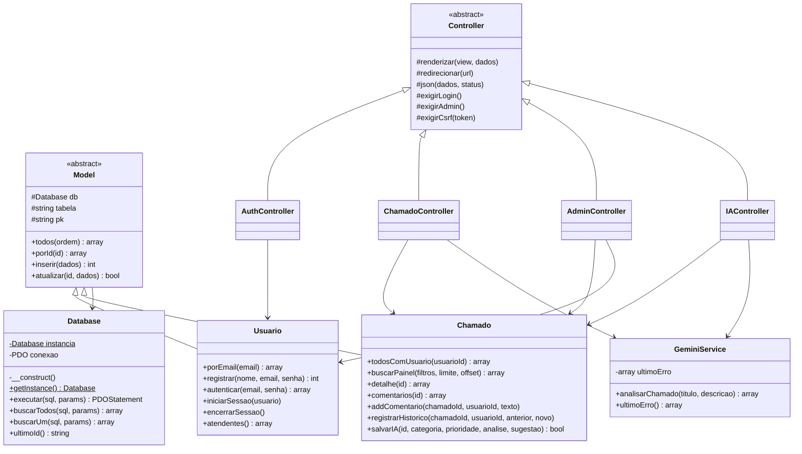
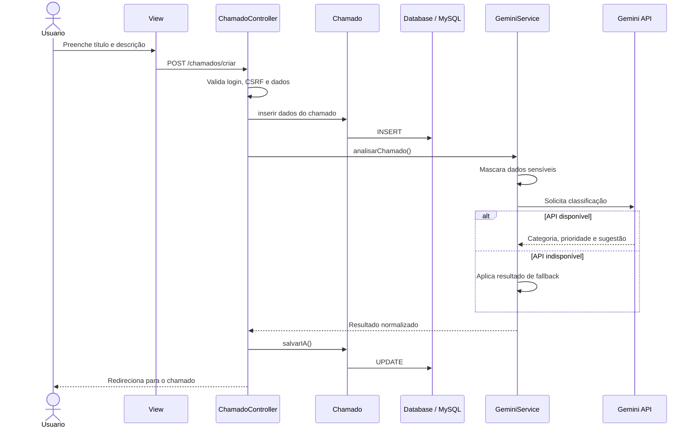

# Programação Orientada a Objetos no SupporteIA

Este documento apresenta como a Programação Orientada a Objetos foi aplicada no SupporteIA. O objetivo da organização em classes é separar responsabilidades, reduzir duplicação e permitir que autenticação, chamados, persistência e integração externa evoluam de forma independente.

## Organização das classes

| Camada | Classes principais | Responsabilidade |
| --- | --- | --- |
| Core | `Database`, `Router`, `Controller`, `Model` | Infraestrutura e comportamentos compartilhados |
| Models | `Usuario`, `Chamado` | Regras e persistência dos dados |
| Controllers | `AuthController`, `ChamadoController`, `AdminController`, `IAController` | Validação e coordenação das requisições |
| Services | `GeminiService` | Integração e tratamento da resposta do Gemini |
| Views | Arquivos em `views/` | Apresentação dos dados ao usuário |

## Pilares da POO

### Encapsulamento

O encapsulamento mantém os detalhes internos protegidos e expõe somente as operações necessárias.

Exemplos:

- `Database` mantém a conexão PDO em uma propriedade privada;
- seu construtor é privado, impedindo instanciação direta;
- `GeminiService` mantém o último erro em uma propriedade privada;
- controllers armazenam models e serviços em propriedades privadas;
- métodos auxiliares, como normalização e mascaramento, permanecem privados.

Trecho simplificado de `src/Core/Database.php`:

```php
class Database
{
    private static ?Database $instancia = null;
    private PDO $conexao;

    private function __construct()
    {
        // Configuração interna da conexão.
    }

    public static function getInstance(): Database
    {
        if (self::$instancia === null) {
            self::$instancia = new self();
        }

        return self::$instancia;
    }
}
```

As demais classes utilizam métodos como `executar()`, `buscarUm()` e `buscarTodos()` sem acessar diretamente a propriedade PDO.

### Herança

A classe abstrata `Model` reúne operações comuns de persistência:

```php
abstract class Model
{
    protected Database $db;
    protected string $tabela;

    public function porId(int $id): array|false { /* ... */ }
    public function inserir(array $dados): int { /* ... */ }
    public function atualizar(int $id, array $dados): bool { /* ... */ }
}
```

Os models concretos herdam esse comportamento:

```php
class Usuario extends Model
{
    protected string $tabela = 'usuarios';
}

class Chamado extends Model
{
    protected string $tabela = 'chamados';
}
```

Assim, `Usuario` e `Chamado` reutilizam as operações genéricas e acrescentam métodos específicos de seus domínios.

Os controllers concretos também herdam recursos da classe abstrata `Controller`, como:

- `renderizar()`;
- `redirecionar()`;
- `exigirLogin()`;
- `exigirAdmin()`;
- `exigirCsrf()`;
- `json()`.

### Abstração

As classes `Model` e `Controller` são abstratas porque representam conceitos gerais da aplicação. Elas não são utilizadas diretamente como uma tela ou entidade, mas definem recursos comuns para classes especializadas.

Essa abstração permite que:

- um controller solicite `$this->chamado->inserir(...)` sem conhecer a implementação do PDO;
- uma view seja renderizada sem conhecer a localização física dos arquivos;
- a aplicação solicite uma análise ao `GeminiService` sem construir manualmente a requisição HTTP;
- o roteador instancie o controller correspondente sem concentrar a regra de negócio.

### Polimorfismo

O polimorfismo aparece principalmente pela substituição de tipos: `Usuario` e `Chamado` podem ser tratados como `Model`, pois compartilham o contrato e as operações herdadas.

Cada model especializa seu comportamento:

- `Usuario` adiciona registro, autenticação e gerenciamento de sessão;
- `Chamado` adiciona filtros, comentários, atribuição, histórico e classificação.

O projeto não utiliza uma hierarquia extensa de sobrescrita de métodos. A escolha foi manter o polimorfismo simples e adequado ao tamanho da aplicação.

## Composição e separação de responsabilidades

Além da herança, o sistema utiliza composição. Um controller mantém referências para os objetos necessários ao seu fluxo.

Exemplo de `ChamadoController`:

```php
class ChamadoController extends Controller
{
    private Chamado $chamado;
    private GeminiService $ia;

    public function __construct()
    {
        $this->chamado = new Chamado();
        $this->ia = new GeminiService();
    }
}
```

Nesse fluxo:

- `ChamadoController` coordena a requisição;
- `Chamado` persiste e consulta dados;
- `GeminiService` realiza a classificação;
- `Controller` fornece autenticação, CSRF e renderização;
- a view apresenta o resultado.

## Diagrama de classes



## Fluxo de criação de chamado



## Relação entre MVC e POO

MVC organiza o projeto por responsabilidade; POO fornece os mecanismos usados nessa organização.

| MVC | Aplicação da POO |
| --- | --- |
| Model | Classes `Usuario` e `Chamado`, herdadas de `Model` |
| View | Arquivos de apresentação separados das regras |
| Controller | Classes especializadas herdadas de `Controller` |
| Service | Objeto dedicado à integração externa |
| Infraestrutura | Objetos `Database` e `Router` |

Essa combinação evita concentrar SQL, HTML, autenticação e integração com API em um único arquivo.

## Benefícios para o projeto

- reutilização das operações comuns de banco;
- menor duplicação entre controllers;
- regras de autenticação e autorização centralizadas;
- integração Gemini isolada do restante da aplicação;
- manutenção facilitada por responsabilidades bem definidas;
- possibilidade de adicionar novos models, controllers e serviços sem reorganizar todo o sistema.
